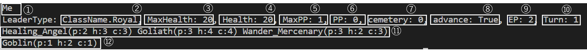
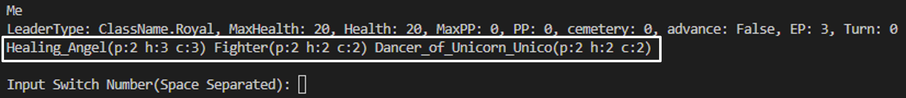

# Analysis of Shadowverse

Cygames 様が提供しているカードゲームアプリShadowverseをPython上で再現するという試みのもと作成したリポジトリ

## Shadowverseのルール説明

Shadowverse 様公式サイト: [ルール説明](https://shadowverse.jp/gameguide/)

## Pythonで開発した理由

1. 研究や大学の授業で使い慣れているので作業がしやすい
2. 今後，ShadowverseをプレイするAIを作成しようとしたときにPythonだと都合が良いと思ったから
   - カードゲームをプレイするAIの作成はこちら

      [強化学習でカードゲームをプレイするAIを作る](https://github.com/Ate25436/reinforce_learning.git)

## このREADMEで使われている用語

- フォロワー
  - バトルの主役となるカードで、場に出して戦わせる．他のカードゲームではユニット，モンスターなど．
- リーダー
  - プレイヤーの分身．フォロワーで攻撃するなどして体力が0以下になるとバトルが終了する．

## 用意しているキーワード能力

- ファンファーレ
  - カードをプレイした際に発動する効果
- ラストワード
  - カードが破壊されたときに発動する効果
- 守護
  - この能力を持っているフォロワーが場にいるときに相手のフォロワーは他のフォロワーやリーダーに攻撃できない
- 疾走
  - この能力を持っているフォロワーは場に出たターンに相手のリーダー，または相手のフォロワーに攻撃できる
- 突進
  - この能力を持っているフォロワーは場に出たターンに相手のフォロワーに攻撃できる（相手のリーダーは攻撃できない）

## 実装したいキーワード能力

- 必殺
  - この能力を持っているフォロワーが相手のフォロワーに攻撃したときにそれを体力に関係なく破壊する
 
## こだわった点

- 処理順
  - Shadowverseではラストワードや交戦時効果など処理順が大切となるゲームなので実際の処理順と同じになるように工夫
- 能力
  - Shadowverseではカードによっては単純な能力の組み合わせでできている（例：相手のリーダーに3ダメージ，自分のリーダーを3回復）．こういった能力を表現しやすくするために数値だけが違う能力（自分のリーダーをX回復など）をまとめて管理できるように工夫

## 使い方

### ディスプレイの見方

- コマンドラインでディスプレイする


①プレイヤー名 (Me or Opponent)

②クラス名 (Elf or Royal or Witch or Dragon or Necromancer or Vampire or Bishop or Nemesis)

③最大HP (0～)

④HP (0～)

⑤最大PP (1～10)

⑥PP (1～10)

⑦墓地 (0～)

⑧先行 (True or False)

⑨EP (0～3)

⑩ターン数 (1～)

⑪手札 (p...攻撃力，h...体力，c...コスト)

⑫場 (p...攻撃力，h...体力)

### 遊び方

現状このシミュレーターは一人遊び用（2人の行動を自分で選択する）ので 2. 以降は自分(Me)と相手(Opponent)のどちらの行動も選択する必要がある

1. カレントディレクトリで以下のコマンドを実施

  ```
  python battle.py
  ```

2. マリガン

   - 初手のカードの入れ変えを行う
   - 白枠の中が今の自分の持ち手札で入れ替えたいカードを左から 0-index，スペース区切りで指定する

   例: Healing_AngelとFighterを入れ替えたい場合は
   ```
   Input Switch Number(Space Separated): 0 1
   ```
   と入力する

3. 対戦

   - コマンドでプレイする
     - p...プレイ
       - プレイするカードを手札の中から 0-index で指定
       - 十分なPPや場に空きがなかったら失敗
     - a...アタック
        - アタックするフォロワーを場の中から 0-index で指定
        - アタック先を相手の場の中から 0-index で指定

          もしくは相手のリーダーに攻撃(6)
        - 指定した先にフォロワーがないと失敗
     - end...ターンエンド
     - evolve...進化
       - 進化するフォロワーを選択
       - EPがないと失敗
     - q...バトル終了
     - h...各コマンドの説明
